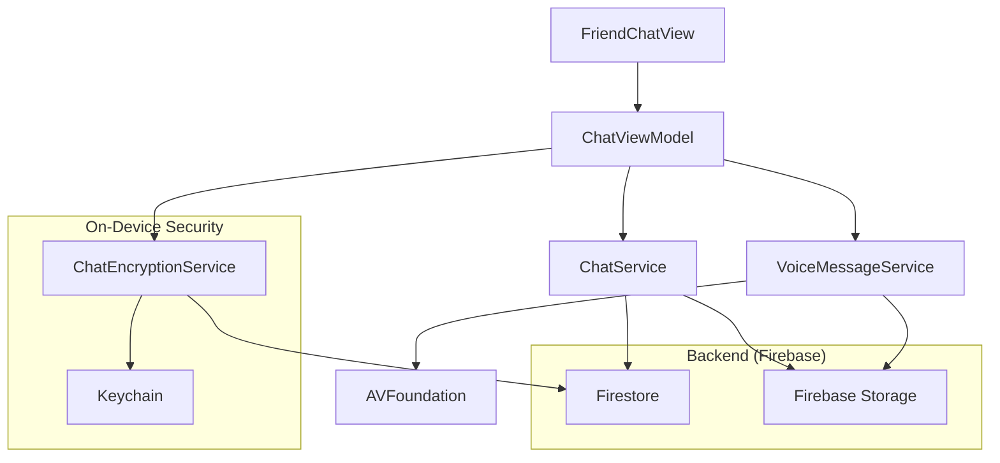
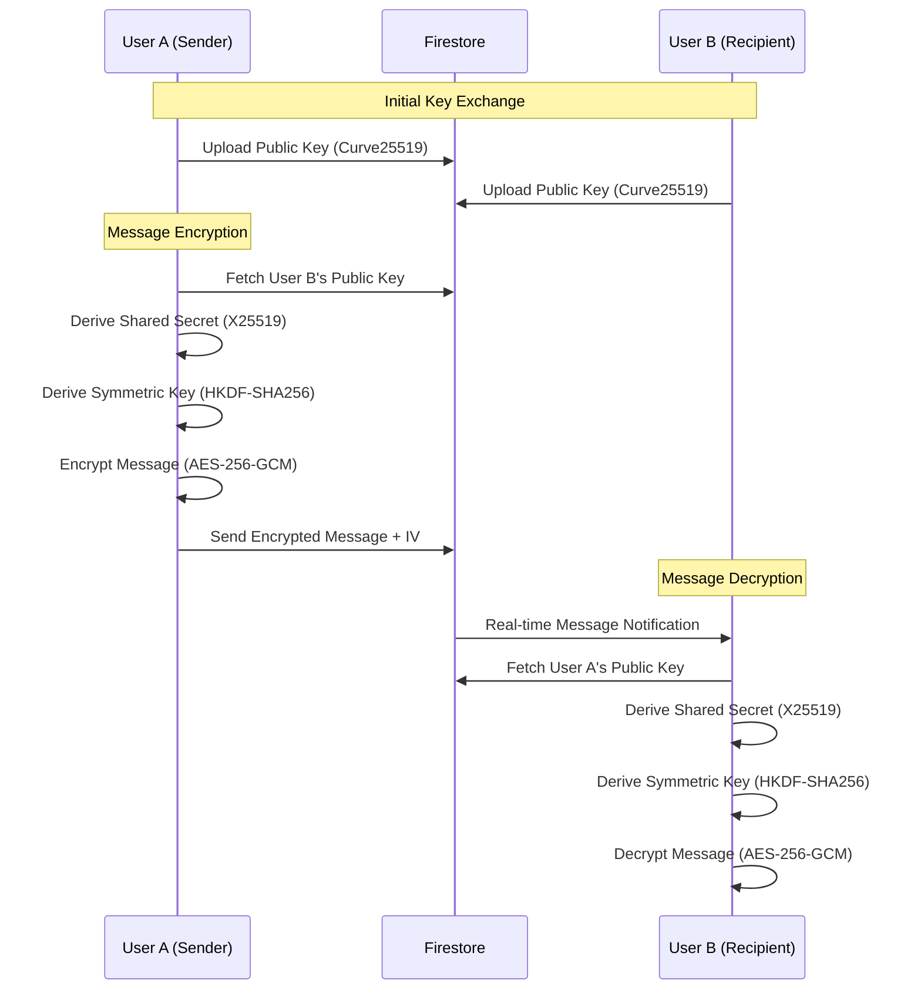

# Friends Chat Technical Guide

## 1. Overview
The Friends Chat feature in FitLink provides a secure, real-time communication platform for users to interact, share fitness plans, and challenge each other. The system is built with privacy at its core, utilizing end-to-end (E2E) encryption for all message content.

## 2. Architecture Overview
The system follows a reactive architecture using SwiftUI and the Model-View-ViewModel (MVVM) pattern, with actor-based services for thread safety and real-time synchronization via Firebase.

### Component Diagram


## 3. End-to-End Encryption (E2E)
FitLink implements E2E encryption using Apple's **CryptoKit** framework. Messages are encrypted on the sender's device and can only be decrypted by the intended recipient.

### 3.1 Encryption Flow


### 3.2 Technical Details
- **Key Exchange**: X25519 (Diffie-Hellman over Curve25519) for establishing a shared secret.
- **Key Derivation**: HKDF (HMAC-based Key Derivation Function) with SHA256. 
    - **Salt**: `chatId.data(using: .utf8)`
    - **Shared Info**: `myPublicKey + theirPublicKey`
- **Symmetric Encryption**: AES-256-GCM (Galois/Counter Mode).
- **Key Storage**:
    - **Private Keys**: Keychain with `chat_private_key` identifier.
    - **Remote Public Keys**: Keychain with `chat_public_key_{userId}` identifier.

### 3.3 Key Implementation (Swift)
```swift
// Symmetric Key Derivation
let sharedSecret = try privateKey.sharedSecretFromKeyAgreement(with: remotePublicKey)
let sharedInfo = privateKey.publicKey.rawRepresentation + remotePublicKey.rawRepresentation
let symmetricKey = sharedSecret.hkdfDerivedSymmetricKey(
    using: SHA256.self,
    salt: chatId.data(using: .utf8)!,
    sharedInfo: sharedInfo,
    outputByteCount: 32
)

// Message Encryption
let sealedBox = try AES.GCM.seal(messageData, using: key, nonce: AES.GCM.Nonce())
let combined = sealedBox.ciphertext + sealedBox.tag
return (combined.base64EncodedString(), Data(nonce).base64EncodedString())
```

## 4. Services Documentation

### 4.1 ChatService (Actor)
The primary interface for Firestore operations.
- **Methods**:
    - `getOrCreateChat(user1Id:user2Id:)`: Initializes or retrieves a deterministic chat thread.
    - `sendMessage(...)`: Encrypts and persists messages to Firestore.
    - `fetchMessages(...)`: Retrieves and decrypts message history.
    - `initializeEncryption(...)`: Performs the public key exchange handshake.
    - `updateTypingStatus(...)`: Manages real-time typing indicators.
    - `createChallenge(...)`: Issues a fitness challenge within the chat.

### 4.2 ChatEncryptionService (Actor)
Handles all cryptographic operations.
- **Methods**:
    - `generateKeyPair()`: Creates a new Curve25519 key pair and stores the private key in Keychain.
    - `deriveSharedKey(withUserId:chatId:)`: Computes the 256-bit symmetric key for a specific chat.
    - `encryptToBase64(message:withUserId:chatId:)`: High-level encryption for strings.
    - `decryptFromBase64(encryptedContent:iv:withUserId:chatId:)`: High-level decryption.

### 4.3 VoiceMessageService (Actor)
Manages audio recording and playback.
- **Implementation**: Uses `AVAudioRecorder` with AAC compression (`kAudioFormatMPEG4AAC`) at 44.1kHz.
- **Storage**: Uploads `.m4a` files to Firebase Storage before sending the message reference via `ChatService`.

## 5. Firestore Data Structure

### `friend_chats` (Collection)
| Field | Type | Description |
| :--- | :--- | :--- |
| `id` | String | `chat_{user1Id}_{user2Id}` (alphabetically sorted) |
| `participant_ids` | Array | IDs of both users |
| `encryption_initialized` | Boolean | True if both users have exchanged public keys |
| `last_message` | Map | Metadata: `sender_id`, `timestamp`, `type`, `encrypted_preview` |
| `typing_status` | Map | `{ "userId": timestamp }` |

### `friend_messages` (Sub-collection)
| Field | Type | Description |
| :--- | :--- | :--- |
| `id` | String | UUID |
| `sender_id` | String | ID of the sender |
| `type` | String | `text`, `image`, `file`, `voice`, `diet_plan`, `workout_plan`, `challenge` |
| `encrypted_content` | String | Base64 AES-GCM ciphertext |
| `iv` | String | Base64 Initialization Vector (Nonce) |
| `payload` | Map | Metadata: `plan_id`, `plan_title`, `voice_url`, `voice_duration`, `image_url`, `file_url`, `challenge_id` |
| `status` | String | `sending`, `sent`, `delivered`, `read` |
| `reply_to` | String | Optional ID of message being replied to |

### `user_keys` (Collection)
| Field | Type | Description |
| :--- | :--- | :--- |
| `user_id` | String | Document ID |
| `public_key` | String | Base64 Curve25519 raw representation |
| `device_id` | String | Identifier for the current installation |

## 6. Firestore Security Rules
```javascript
rules_version = '2';
service cloud.firestore {
  match /databases/{database}/documents {
    // Chat threads: participants only
    match /friend_chats/{chatId} {
      allow read, write: if request.auth != null && request.auth.uid in resource.data.participant_ids;
      
      // Messages: inherited chat access
      match /friend_messages/{messageId} {
        allow read: if request.auth != null && 
          request.auth.uid in get(/databases/$(database)/documents/friend_chats/$(chatId)).data.participant_ids;
        allow create: if request.auth != null && 
          request.auth.uid == request.resource.data.sender_id &&
          request.auth.uid in get(/databases/$(database)/documents/friend_chats/$(chatId)).data.participant_ids;
      }
    }
    
    // Public keys: globally readable (for friends), writeable by owner only
    match /user_keys/{userId} {
      allow read: if request.auth != null;
      allow write: if request.auth != null && request.auth.uid == userId;
    }
  }
}
```

## 7. Firebase Storage Usage
- **Images**: Stored in `chat_images/{chatId}/{imageId}.jpg`.
- **Voice Messages**: Stored in `voice_messages/{chatId}/{messageId}.m4a`.
- **Security**: Content should be encrypted before upload (Current implementation encrypts the *reference* in the message, but file content itself relies on Storage rules for isolation).

## 8. Setup Requirements
To enable Friends Chat in a new environment:
1.  **Firebase Console**:
    *   Enable **Firestore** and **Cloud Storage**.
    *   Deploy the security rules provided in Section 6.
    *   Enable **Anonymous** or **Email/Password** Authentication.
2.  **App Capabilities**:
    *   Add **Push Notifications** (optional for background sync).
    *   Enable **Keychain Sharing** if sharing keys across multiple apps/extensions.
    *   Include `NSMicrophoneUsageDescription` in `Info.plist`.

## 9. Design Decisions & Trade-offs
- **Deterministic Chat IDs**: By using `chat_{minId}_{maxId}`, we avoid duplicate threads and simplify lookup without a separate "find thread" query.
- **HKDF Salt/Info**: Using `chatId` as salt ensures that even if a user has the same shared secret across different chats (unlikely but possible), the resulting symmetric keys will be unique per chat.
- **Actor-Based Services**: Prevents data races in cryptographic state (like cached symmetric keys) and Firestore listener management.
- **Real-time vs Local Cache**: The system prioritizes real-time Firestore sync. Local persistence is currently handled by Firestore's 100MB offline cache, avoiding a separate CoreData/SQLite implementation for the MVP.
